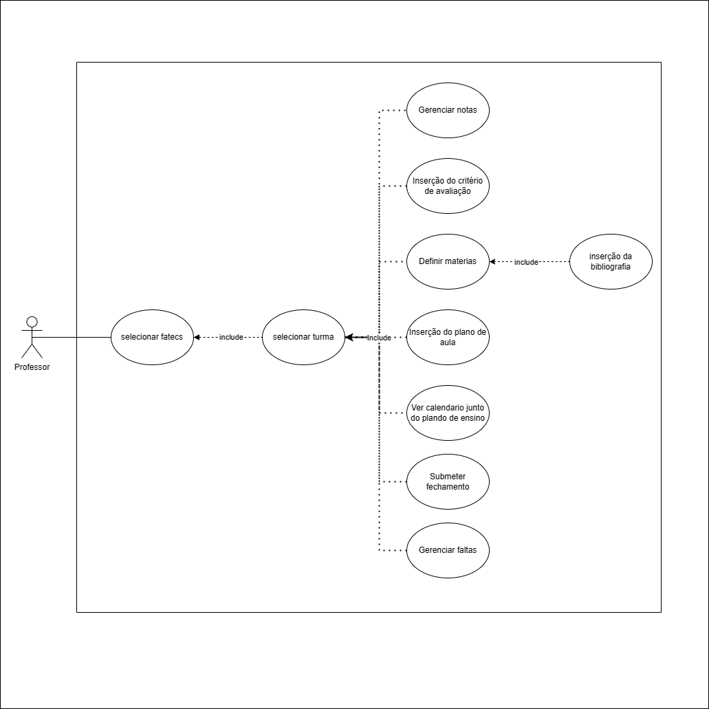

# sigaSohQbom2.0

## integrantess
Felippe Ramos Marcial Dornellas |
Huko Nogueira Koketu |
Luis Gustavo |
Matheus Della |
Antonio William |

## Aluno

### Requisitos funcionais

| codigo | nome                                        |
| ------ | ------------------------------------------- |
| RF01   | Refazer matricula                           |
| RF02   | Ver Histórico                               |
| RF03   | Ver notas parciais (correntes)              |
| RF04   | Ver faltas parciais (correntes)             |
| RF05   | Ver planejamento de aulas                   |
| RF06   | Solicitar revisão de notas após fechamento  |
| RF07   | Solicitar revisão de faltas após fechamento |
| RF08   | Ver horário da aula (correntes)             |
| RF09   | Ver datas de prova (correntes)              |
| RF10   | Ver disciplinas correntes                   |

### Caso de uso

## Professor

### Requisitos funcionais

| codigo | nome                                           |
| ------ | ---------------------------------------------- |
| RF01   | Inserção do plano de aula                      |
| RF02   | Inserção do critério de avaliação              |
| RF03   | inserção da bibliografia                       |
| RF04   | Definir materias                               |
| RF05   | Gerenciar notas                                |
| RF06   | Gerenciar faltas                               |
| RF08   | Submeter fechamento                            |
| RF09   | revisao da nota (depois do fechamento de nota) |
| RF10   | Selecionar fatec                               |
| RF11   | Selecionar turma                               |

### Caso de uso

## Secretaria

### Requisitos funcionais

| codigo | nome                                       |
| ------ | ------------------------------------------ |
| RF01   | Matricular aluno                           |
| RF02   | Inserir professor                          |
| RF03   | Inserir curso                              |
| RF04   | Inserir Disciplina                         |
| RF05   | Estabelecer relação professor - disciplina |

### Caso de uso

